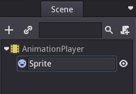
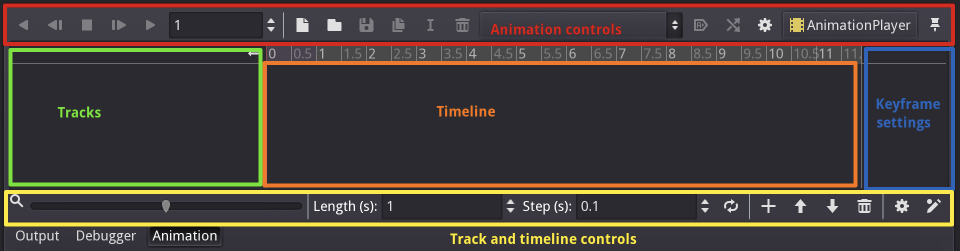
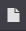
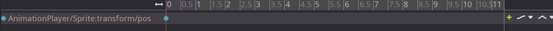
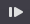
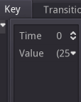
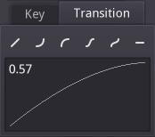
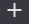
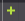
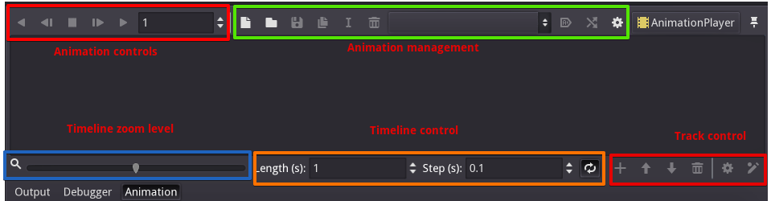

# Introduction to the 2D animation features

## Overview

Wether it's animating a logo, a character or a user interface, animation
is a key part of each developed game.

Godot has a powerful animation engine, that allows the developer to create
anything from a simple to a complex animation.

In this guide you will learn the basics of a very key part of Godot's 2D
animation system: the AnimationPlayer. You will get to know its user
interface and create a simple animation with it. If you are an advanced
Godot user, you will also learn how to call node functions in an animation.

## Animation components

Animations in Godot consist of the timeline, tracks, and (key-)frames.

The timeline is the concerted animation based on tracks and frames.

A track is a reference to a property, that is modified during the animation.
An example would be the sprite's transform property's position value,
that is modified to match a path between two points A and B.

Keyframes are key points in the timeline, that specify a goal value for a
property of a track. The frames between key frames are not directly editable
and are generated by the animation engine, usually interpolating the property
values between two keyframes.

## The whereabouts

When doing animation in Godot you're dealing with three parts:

* One or more AnimationPlayer nodes (although one is usually enough)
* The animation tab
* Some nodes to animate

### AnimationPlayer nodes

The AnimationPlayer node type is the data container for your animations. One
AnimationPlayer node can hold multiple animations, that can automatically
transition to one another.

### Animation tab

When selecting an AnimationPlayer node in the Scene Tree, the animation
tab (found on the lower panel by default) will open up.

It mainly consits of three parts:

* Animation controls (i.e. add, load, save, and delete animations)
* The tracks listing
* The timeline with keyframes, displayed as dots
* The track modifiers and keyframe editor (when enabled)
* The timeline and track controls, where you can zoom the timeline and edit
  tracks for example.

See the [Animation tab reference](#animation-tab-reference) below for details.

## Tutorial: Creating a simple animation

### Scene setup

For this tutorial, we'll going to create an AnimationPlayer node and
a sprite node as a AnimationPlayer node child.

The sprite will hold a image texture and we will animate that sprite
to move between two points on the screen. As a starting point, move the
sprite to a left position on the screen.

---

*Note*

Adding animated nodes as children to the AnimationPlayer node is not required,
but it is a nice way of distinguishing animated parts from non-animated
parts in the Scene Tree.

---

Select the AnimationPlayer node and click on "Add animation"
() in the animation
tab to add a new animation.

Enter a name for the animation in the dialog box.

### Adding a track

To add a new track for our sprite, select it and take a look in the toolbar:

These switches and buttons allow you to add keyframes for the selected node's
location, rotation, and scale respectively.

Deselect rotation, because we are only interested in the location of our sprite
for this tutorial and click on the key button.

As we don't have a track already set up for the transform/location property,
Godot will ask, wether it should set it up for us. Click on "Create".

This will create a new track and our very first keyframe at the beginning of
the timeline:

The track name is composed of a Node Path, followed by a colon,
followed by a reference to its property, that we would like to modify.

In our example, the path is `AnimationPlayer/Sprite` and the property is
`transform/pos`.

The path always starts at the AnimationPlayer node's parent (so
  paths always have to include the AnimationPlayer node itself).

---

*Note*

Don't worry! If you change the names of nodes in the Scene Tree, that you
already have tracks for. Godot will automatically update the paths in
the tracks.

---

### The second keyframe

Now we need to set the destination where our sprite should be headed and how
much time it will take to get there.

Let's say, we want it to take 2 seconds to go to the other point. By default
the animation is set to last only 1 second, so change this in the timeline
controls animation tab's lower panel to 2.

Click on the timeline header near the 2 second mark and move the sprite
to the target destination on the right side.

Again, click the key button in the toolbar. This will create our second
keyframe - represented by a blue dot in the timeline.

### Run the animation

Click on the "Play from beginning"
() button.

Yay! Our animation runs:

### Back and forth

As you can see, the "loop" button is enabled by default and our animation
loops. Godot has an additional feature here. Like said before, Godot
always calculates the frames between two keyframes. In a loop, the first
keyframe is also the last keyframe, if no keyframe is specified at the end.

If you set the animation length to 4 seconds now, the animation will
move back and forth.

### Track settings

Each track has a settings panel at the end, where you can set the update rate
and the track interpolation.

The update rate of a track tells Godot when to update the property values.
This can be:

* Continuous: Update the property on each frame
* Discrete: Only update the property on keyframes
* Trigger: Only update the property on keyframes or triggers

In normal animations, you will usually use "Continuous". The other types
are used to script complex animations.

The interpolation tells Godot how to calculate the frame values between the
keyframes. These interpolation modes are supported:

* Nearest: Set the nearest keyframe value
* Linear: Set the value based on a linear function calculation between the two
  keyframes
* Cubic: Set the value based on a curved function calculation between the two
  keyframes

Cubic interpolation will lead to a more natural movement, where the animation
is slower at a keyframe and faster between keyframes. This is usually used
for character animation. Linear interpolation will create more of a robotic
movement.

## Keyframes for other properties

Godot doesn't restrict to only edit transform properties. Every
property can be used as a track where you can set keyframes.

If you select your sprite while the animation tab is visible, you get a small
keyframe button for all of the sprite's properties. Click on this button and
Godot will automatically add a track and keyframe to the current animation.

## Edit keyframes

For advanced use and to edit keyframe in detail, the keyframe editor
() can be enabled.

This will add an editor pane on the right side of the track settings. When
you select a keyframe, you can directly edit its values in this editor:

Additionally, you can also edit the transition value for this keyframe:

This will tell Godot, how to change the property values when it reaches
this keyframe.

You usually tweak your animations this way, when the movement doesn't
"look right".

## Advanced: Call Func tracks

Godot's animation engine doesn't stop here. If you're already comfortable with
Godot's scripting language GDScript and API you know that each node type
is a class and has a bunch of functions, that can be called.

For example, the [`SamplePlayer2D`](http://docs.godotengine.org/en/stable/classes/class_sampleplayer2d.html)
node type has a function to play a sample.

Wouldn't it be great to play a sample at a specific keyframe in an animation?
This is where "Call Func Tracks" come in handy. These tracks reference a
node again, this time without a reference to a property. Instead a keyframe
holds the name and arguments of a function to be called.

To let Godot play a sample when it reaches a keyframe, follow this list:

* Add a SamplePlayer2D to the Scene Tree and add a sample library and a sample
to it
* Click on "Add track" ()
on the animation tab's track controls
* Select "Add Call Func Track" from the list of possible track types
* Select the SamplePlayer2D node in the selection window. Godot will add the
  track with the reference to the node
* Select the frame, where the sample should be played by using the timeline
  header
* Click on "Add keyframe" near the settings of our func track
  ().
* Select the keyframe
* Enable the Keyframe Editor
* Enter "play" as the function name and set the argument counter to 1
* Select "String" as the first argument type and use the sample name as the
argument value

When Godot reaches the keyframe, Godot will call the SamplePlayer2D node's
"play" function with the sample name.

## References

### Animation tab reference

The animation tab has the following parts:

* Animation controls
   * Play animation backwards from current position
   * Play animation backwards from the animation end
   * Stop animation
   * Play animation forwards from the animation beginning
   * Play animation forwards from the current position
   * Direct time selection
* Animation management:
   * Create a new animation
   * Load animation
   * Save animation
   * Duplicate animation
   * Rename animation
   * Delete animation
   * Animation selection
   * Automatically play selected animation
   * Edit animation blend times
   * Extended animation Tools
* Timeline zoom level control
* Timeline control
   * Length of animation
   * Steps of animation
   * Toggle loop animation
* Track controls
   * Add track
   * Move track up
   * Move track down
   * Delete track
   * Extended track tools
   * Toggle keyframe editor
