# Introduction to the 2D animation features

## Overview

The :ref:class_AnimationPlayer node allows you to create anything from simple to complex animations.

In this guide you learn to:

- Work with the Animation Panel
- Animate any property of any node
- Create a simple animation
- Call functions with the powerful Call Function Tracks

In Godot you can animate anything you find in the Inspector. Animations are changes to properties over time. This means you can animate anything visual in nature: sprites, UI elements, particles, the visibility, and color of textures. But not only. You can also control gameplay related values and call any function.

## Create an AnimationPlayer node

To use the animation tools we first have to create an :ref:class_AnimationPlayer node.

The AnimationPlayer node type is the data container for your animations. One AnimationPlayer node can hold multiple animations, that can automatically transition to one another.

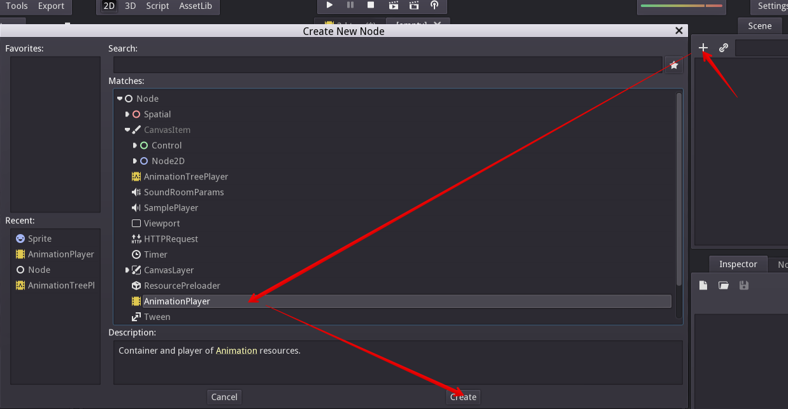

Click on the AnimationPlayer node in the Node tab to open the Animation Panel at the bottom of the viewport.

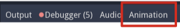

It consists of five parts:

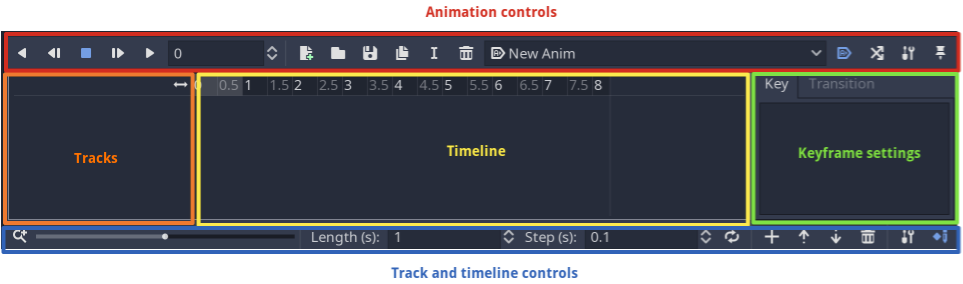

* Animation controls (i.e. add, load, save, and delete animations)
* The tracks listing
* The timeline with keyframes
* The keyframe editor (when enabled)
* The timeline and track controls, where you can zoom the timeline and edit tracks for example.

See the [animation panel reference](#animation-panel-reference) below for details.

## Computer animation relies on keyframes

A keyframe defines the value of a property at a certain point in time.

White and blue diamond shapes represent keyframes in the timeline.

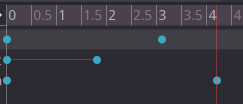

The engine interpolates values between keyframes, resulting in a gradual change in values over time.

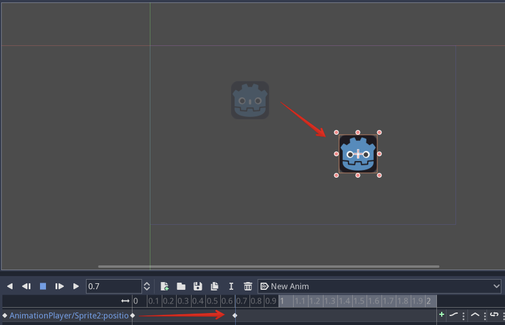

The timeline lets you insert keyframes and change their timing. It also defines how long the animation is.

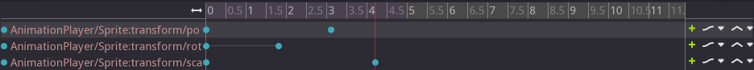

Each line of the Animation Panel is an animation track. Normal and Transform tracks reference node properties. Their name or id is a path to the node and the affected property.

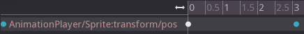

.. tip::

If you animate the wrong property, you can edit a track's path anytime. Double click on it and type the new path. Play the animation using the "Play from beginning" button  (Default shortcut: Shift+D) to see the changes instantly.

## Tutorial: Creating a simple animation

### Scene setup

For this tutorial, we'll going to create an AnimationPlayer node and a sprite node as an AnimationPlayer node child.

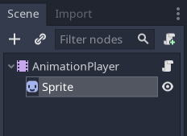

The sprite holds an image texture and we animate that sprite to move between two points on the screen. As a starting point, move the sprite to a left position on the screen.

.. tip::

Adding animated nodes as children to the AnimationPlayer node is not required, but it is a nice way of distinguishing animated nodes from non-animated nodes in the Scene Tree.

Select the AnimationPlayer node and click on "Add animation" () in the animation  tab to add a new animation.

Enter a name for the animation in the dialog box.

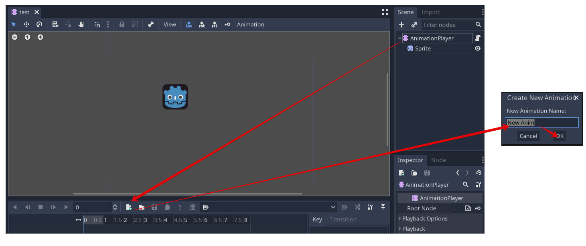

### Adding a track

To add a new track for our sprite, select it and take a look in the toolbar:

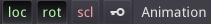

These switches and buttons allow you to add keyframes for the selected node's location, rotation, and scale respectively.

Deselect rotation, because we are only interested in the location of our sprite for this tutorial and click on the key button.

As we don't have a track already set up for the transform/location property, Godot asks, wether it should set it up for us. Click on "Create".

This creates a new track and our very first keyframe at the beginning of the timeline:

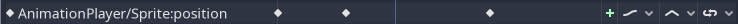

The track name consists of a Node Path, followed by a colon, followed by a reference to its property, that we would like to modify.

In our example, the path is `AnimationPlayer/Sprite` and the property is `position`.

The path always starts at the AnimationPlayer node's parent (so paths always have to include the AnimationPlayer node itself).

.. note::

   Don't worry if you change the names of nodes in the Scene Tree, that you already have tracks for. Godot automatically updates the paths in the tracks.

### The second keyframe

Now we need to set the destination where our sprite should be headed and how much time it takes to get there.

Let's say, we want it to take 2 seconds to go to the other point. By default the animation is set to last only 1 second, so change this in the timeline controls in animation panel's lower panel to 2.

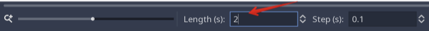

Click on the timeline header near the 2 second mark and move the sprite to the target destination on the right side.

Again, click the key button in the toolbar. This creates our second keyframe.

### Run the animation

Click on the "Play from beginning" () button.

Yay! Our animation runs:

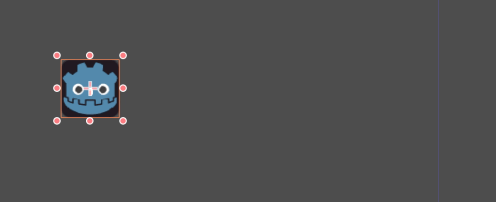

### Back and forth

As you can see, the "loop" button is enabled by default and our animation loops. Godot has an additional feature here. Like said before, Godot always calculates the frames between two keyframes. In a loop, the first keyframe is also the last keyframe, if no keyframe is specified at the end.

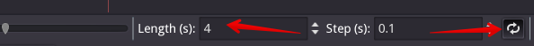

If you set the animation length to 4 seconds now, the animation moves back and forth. You can change this behaviour if you change the track's loop mode. This is covered in the next chapter.

### Track settings

Each track has a settings panel at the end, where you can set the update rate, the track interpolation, and the loop mode.

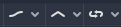

The update rate of a track tells Godot when to update the property values. This can be:

* Continuous: Update the property on each frame
* Discrete: Only update the property on keyframes
* Trigger: Only update the property on keyframes or triggers

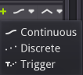

In normal animations, you usually use "Continuous". The other types are used to script complex animations.

The interpolation tells Godot how to calculate the frame values between the keyframes. These interpolation modes are supported:

* Nearest: Set the nearest keyframe value
* Linear: Set the value based on a linear function calculation between the two keyframes
* Cubic: Set the value based on a cubic function calculation between the two keyframes

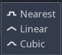

Cubic interpolation leads to a more natural movement, where the animation is slower at a keyframe and faster between keyframes. This is usually used for character animation. Linear interpolation creates more of a robotic movement.

Godot supports two loop modes, which affect the animation if it's set to loop:

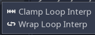

* Clamp loop interpolation: When this is selected, the animation stops after the last keyframe for this track. When the first keyframe is reached again, the animation will reset to its values.
* Wrap loop interpolation: When this is selected, Godot calculates the animation after the last keyframe to reach the values of the first keyframe again.

## Keyframes for other properties

Godot doesn't restrict you to only edit transform properties. Every property can be used as a track where you can set keyframes.

If you select your sprite while the animation panel is visible, you get a small keyframe button for all of the sprite's properties. Click on this button and Godot automatically adds a track and keyframe to the current animation.

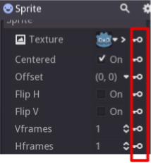

## Edit keyframes

For advanced use and to edit keyframe in detail, enable the keyframe editor ().

This adds an editor pane on the right side of the track settings. When you select a keyframe, you can directly edit its values in this editor:

Additionally, you can also edit the transition value for this keyframe:

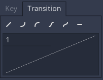

This tells Godot, how to change the property values when it reaches this keyframe.

You usually tweak your animations this way, when the movement doesn't "look right".

## Advanced: Call Func tracks

Godot's animation engine doesn't stop here. If you're already comfortable with Godot's scripting language :ref:toc-learn-scripting-gdscript and :ref:toc-class-ref you know that each node type is a class and has a bunch of callable functions.

For example, the :ref:class_AudioStreamPlayer node type has a function to play an audio stream.

Wouldn't it be great to play a stream at a specific keyframe in an animation? This is where "Call Func Tracks" come in handy. These tracks reference a node again, this time without a reference to a property. Instead, a keyframe holds the name and arguments of a function, that Godot should call when it reaches this keyframe.

To let Godot play a sample when it reaches a keyframe, follow this list:

Add a :ref:class_AudioStreamPlayer to the Scene Tree and setup a stream using an audio file you put in your project.

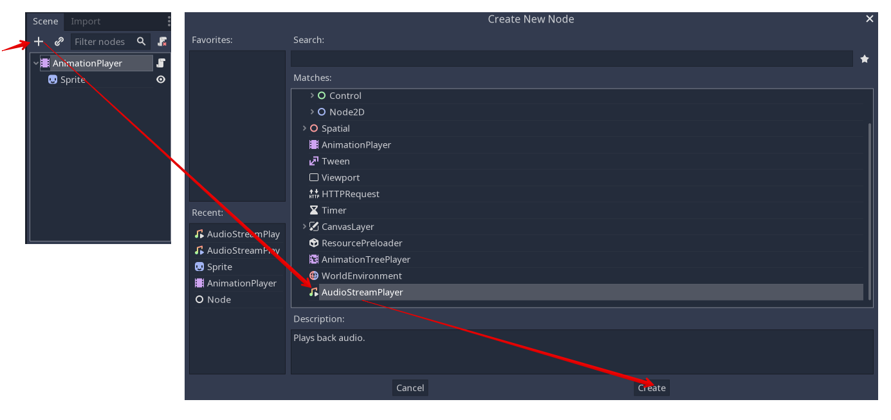

Click on "Add track" () on the animation panel's track controls.

Select "Add Call Func Track" from the list of possible track types.

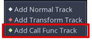

Select the :ref:class_AudioStreamPlayer node in the selection window. Godot adds the track with the reference to the node.

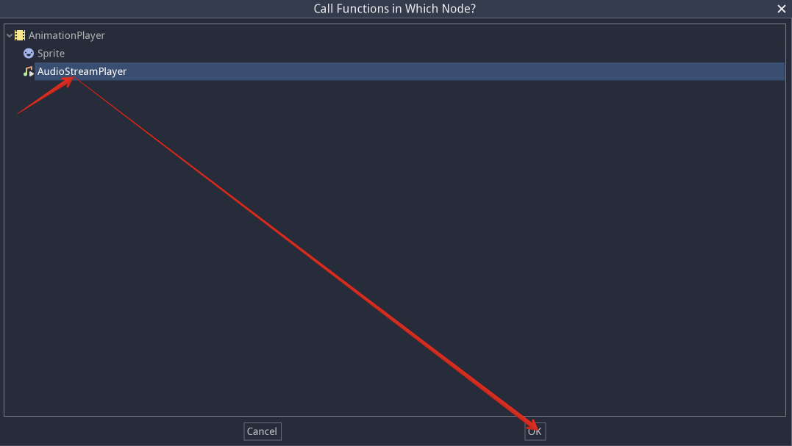

Select the timeline position, where Godot should play the sample by clicking on the timeline header.

Enable the Keyframe Editor by clicking on .

Click on "Add keyframe" near the settings of our func track (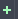) and select the keyframe.

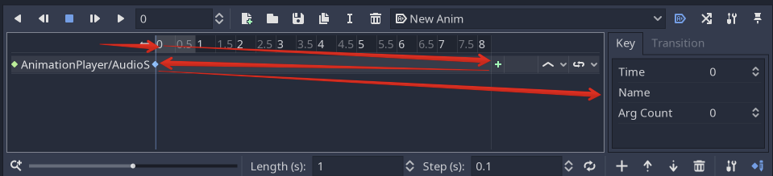

Enter "play" as the function name.

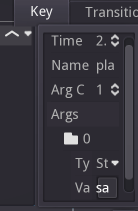

When Godot reaches the keyframe, Godot calls the :ref:class_AnimationPlayer node's "play" function and the stream plays.

## References

### Animation panel reference

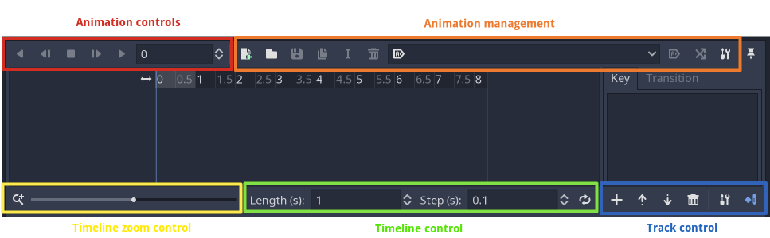

The animation panel has the following parts (from left to right):

#### Animation controls

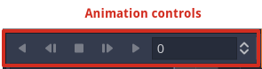

* Play animation backwards from current position
* Play animation backwards from the animation end
* Stop animation
* Play animation forwards from the animation beginning
* Play animation forwards from the current position
* Direct time selection

#### Animation management

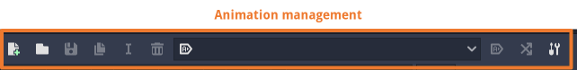

* Create a new animation
* Load animation
* Save animation
* Duplicate animation
* Rename animation
* Delete animation
* Animation selection
* Automatically play selected animation
* Edit animation blend times
* Extended animation Tools

#### Timeline zoom level control

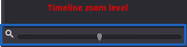

#### Timeline control

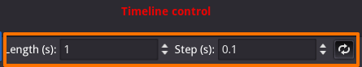

* Length of animation
* Steps of animation
* Toggle loop animation

#### Track control

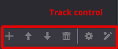

* Add track
* Move track up
* Move track down
* Delete track
* Extended track tools
* Toggle keyframe editor
