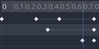
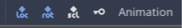
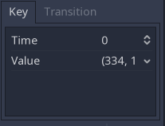

# Introduction to the 2D animation features

## Overview

The `AnimationPlayer` node allows you to create anything from simple to complex animations.

In this guide you learn to:

- Work with the Animation Panel
- Animate any property of any node
- Create a simple animation
- Call functions with the powerful Call Function Tracks

In Godot you can animate anything you find in the Inspector. Animations are changes to properties over time. This means you can animate anything visual in nature: sprites, UI elements, particles, the visibility, and color of textures. But not only. You can also control gameplay related values and call any function.

## Create an AnimationPlayer node

To use the animation tools we first have to create an `AnimationPlayer` node.

<!-- TODO: show how to create anim player with Pics -->

Click on the AnimationPlayer node in the Node tab to open the Animation Panel at the bottom of the Viewport.

<!-- TODO: brief overview of the animation panel -->

## Computer animation relies on keyframes

On the computer animations rely on keyframes. A keyframe defines the value of a property at a certain point in time.

White and blue diamond shapes represent keyframes in the timeline.

The engine interpolates values between keyframes, resulting in a gradual change in values over time.

The timeline lets you insert keyframes and change their timing. It also defines how long the animation is.

Each line of the Animation Panel is an animation track. Normal and Transform tracks reference node properties. Their name or id is a path to the node.

`
.. tip::

If you animate the wrong property, you can edit a track's path anytime. Double click on it and type the new path. Play the animation with Shift D to see the changes instantly.
`

## The whereabouts

When doing animation in Godot you're dealing with three parts:

* One or more AnimationPlayer nodes (although one is usually enough)
* The animation panel
* Some nodes to animate

### AnimationPlayer nodes

The AnimationPlayer node type is the data container for your animations. One
AnimationPlayer node can hold multiple animations, that can automatically
transition to one another.

### animation panel

When selecting an AnimationPlayer node in the Scene Tree, the animation
panel (found on the lower panel by default) opens.

It consists of five parts:

* Animation controls (i.e. add, load, save, and delete animations)
* The tracks listing
* The timeline with keyframes
* The track modifiers and keyframe editor (when enabled)
* The timeline and track controls, where you can zoom the timeline and edit
  tracks for example.

See the [animation panel reference](#animation-tab-reference) below for details.

## Tutorial: Creating a simple animation

### Scene setup

For this tutorial, we'll going to create an AnimationPlayer node and
a sprite node as a AnimationPlayer node child.

The sprite holds an image texture and we animate that sprite
to move between two points on the screen. As a starting point, move the
sprite to a left position on the screen.

`
.. tip::

Adding animated nodes as children to the AnimationPlayer node is not required,
but it is a nice way of distinguishing animated nodes from non-animated
nodes in the Scene Tree.
`

Select the AnimationPlayer node and click on "Add animation"
() in the animation
tab to add a new animation.

Enter a name for the animation in the dialog box.

### Adding a track

To add a new track for our sprite, select it and take a look in the toolbar:

These switches and buttons allow you to add keyframes for the selected node's
location, rotation, and scale respectively.

Deselect rotation, because we are only interested in the location of our sprite
for this tutorial and click on the key button.

As we don't have a track already set up for the transform/location property,
Godot asks, wether it should set it up for us. Click on "Create".

This creates a new track and our very first keyframe at the beginning of
the timeline:

The track name consists of a Node Path, followed by a colon,
followed by a reference to its property, that we would like to modify.

In our example, the path is `AnimationPlayer/Sprite` and the property is
`transform/pos`.

The path always starts at the AnimationPlayer node's parent (so
  paths always have to include the AnimationPlayer node itself).

`
.. note::

Don't worry! If you change the names of nodes in the Scene Tree, that you
already have tracks for. Godot automatically updates the paths in
the tracks.
`

### The second keyframe

Now we need to set the destination where our sprite should be headed and how
much time it takes to get there.

Let's say, we want it to take 2 seconds to go to the other point. By default
the animation is set to last only 1 second, so change this in the timeline
controls animation panel's lower panel to 2.

Click on the timeline header near the 2 second mark and move the sprite
to the target destination on the right side.

Again, click the key button in the toolbar. This creates our second
keyframe.

### Run the animation

Click on the "Play from beginning"
() button.

Yay! Our animation runs:

### Back and forth

As you can see, the "loop" button is enabled by default and our animation
loops. Godot has an additional feature here. Like said before, Godot
always calculates the frames between two keyframes. In a loop, the first
keyframe is also the last keyframe, if no keyframe is specified at the end.

If you set the animation length to 4 seconds now, the animation moves back and forth.

### Track settings

Each track has a settings panel at the end, where you can set the update rate
and the track interpolation.

The update rate of a track tells Godot when to update the property values.
This can be:

* Continuous: Update the property on each frame
* Discrete: Only update the property on keyframes
* Trigger: Only update the property on keyframes or triggers

In normal animations, you usually use "Continuous". The other types
are used to script complex animations.

The interpolation tells Godot how to calculate the frame values between the
keyframes. These interpolation modes are supported:

* Nearest: Set the nearest keyframe value
* Linear: Set the value based on a linear function calculation between the two
  keyframes
* Cubic: Set the value based on a curved function calculation between the two
  keyframes

Cubic interpolation leads to a more natural movement, where the animation
is slower at a keyframe and faster between keyframes. This is usually used
for character animation. Linear interpolation creates more of a robotic
movement.

## Keyframes for other properties

Godot doesn't restrict to only edit transform properties. Every
property can be used as a track where you can set keyframes.

If you select your sprite while the animation panel is visible, you get a small
keyframe button for all of the sprite's properties. Click on this button and
Godot automatically adds a track and keyframe to the current animation.

## Edit keyframes

For advanced use and to edit keyframe in detail, enable the keyframe editor
().

This adds an editor pane on the right side of the track settings. When
you select a keyframe, you can directly edit its values in this editor:

Additionally, you can also edit the transition value for this keyframe:

This tells Godot, how to change the property values when it reaches
this keyframe.

You usually tweak your animations this way, when the movement doesn't
"look right".

## Advanced: Call Func tracks

Godot's animation engine doesn't stop here. If you're already comfortable with
Godot's scripting language GDScript and API you know that each node type
is a class and has a bunch of callable functions.

For example, the [`SamplePlayer2D`](http://docs.godotengine.org/en/stable/classes/class_sampleplayer2d.html)
node type has a function to play a sample.

Wouldn't it be great to play a sample at a specific keyframe in an animation?
This is where "Call Func Tracks" come in handy. These tracks reference a
node again, this time without a reference to a property. Instead a keyframe
holds the name and arguments of a function, that Godot should call when reaching this keyframe.

To let Godot play a sample when it reaches a keyframe, follow this list:

* Add a SamplePlayer2D to the Scene Tree and add a sample library and a sample
to it
* Click on "Add track" ()
on the animation panel's track controls
* Select "Add Call Func Track" from the list of possible track types
* Select the SamplePlayer2D node in the selection window. Godot adds the
  track with the reference to the node
* Select the timeline position, where Godot should play the sample by clicking on the timeline header
* Click on "Add keyframe" near the settings of our func track
  ().
* Select the keyframe
* Enable the Keyframe Editor
* Enter "play" as the function name and set the argument counter to 1
* Select "String" as the first argument type and use the sample name as the
argument value

When Godot reaches the keyframe, Godot calls the SamplePlayer2D node's
"play" function with the sample name.

## References

### animation panel reference

The animation panel has the following parts:

* Animation controls
   * Play animation backwards from current position
   * Play animation backwards from the animation end
   * Stop animation
   * Play animation forwards from the animation beginning
   * Play animation forwards from the current position
   * Direct time selection
* Animation management:
   * Create a new animation
   * Load animation
   * Save animation
   * Duplicate animation
   * Rename animation
   * Delete animation
   * Animation selection
   * Automatically play selected animation
   * Edit animation blend times
   * Extended animation Tools
* Timeline zoom level control
* Timeline control
   * Length of animation
   * Steps of animation
   * Toggle loop animation
* Track controls
   * Add track
   * Move track up
   * Move track down
   * Delete track
   * Extended track tools
   * Toggle keyframe editor
